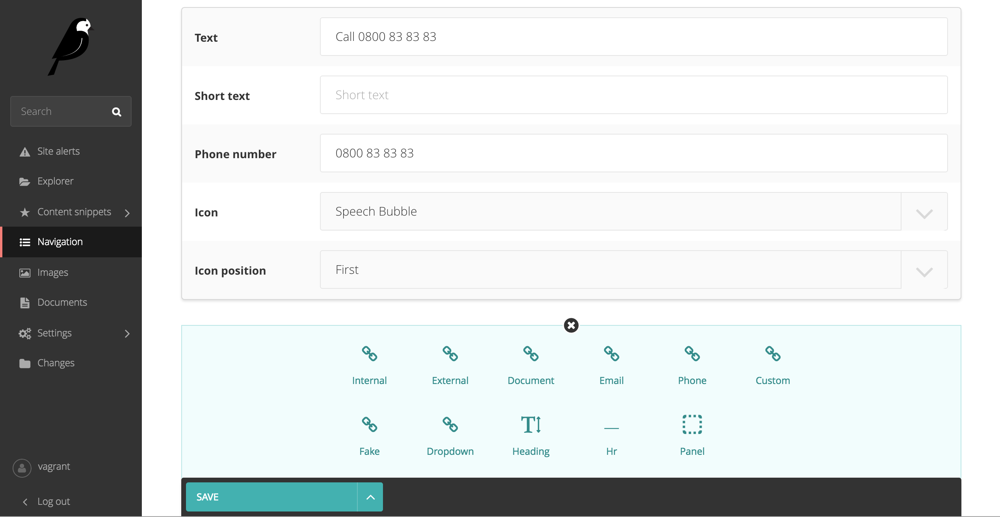

**!! WARNING: This repo isn't maintained anymore !!**

Overriding Wagtail CSS isn't sustainable and makes upgrading to a newer version more difficult.
Designers are now more closely involved with the development of Wagtail (e.g. see the `Streamfield UI Changes <https://github.com/wagtail/wagtail/pull/3942>`_) so we are confident that hacks like this project are no longer needed.

Wagtail Facelift
================

    Drop-in CSS enhancements for Wagtail's Streamfield. Pure CSS overrides, there's no extra configuration.
    
Check out `Awesome Wagtail <https://github.com/springload/awesome-wagtail>`_ for more awesome packages and resources from the Wagtail community.

Installation
------------

.. code:: sh

    pip install git+https://github.com/springload/wagtailfacelift.git

Add the application to your installed apps:

.. code:: python

    INSTALLED_APPS = [
        'wagtail',
        'wagtailfacelift'
    ]

---

Extra theming
-------------

`.multi-field-dark`

Apply this class to your widget for a subtle background shift, eg:

.. code:: python

    MultiFieldPanel([
        StreamFieldPanel('heroes'),
        ],
        heading="Homepage Heroes",
        classname="collapsible collapsed multi-field-dark"
    )

Enjoy!

